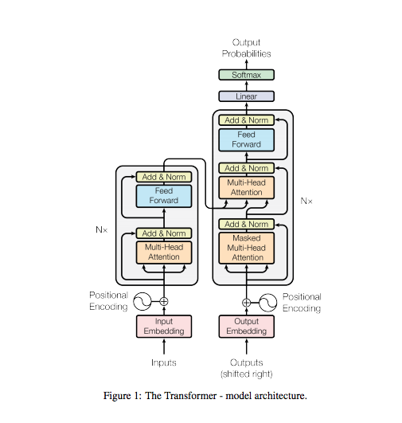
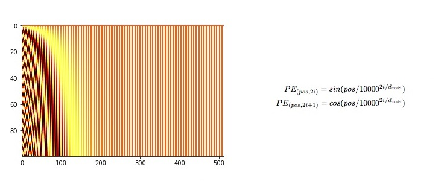
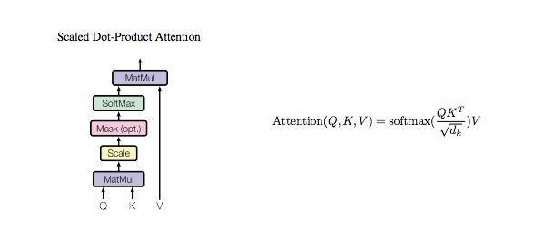
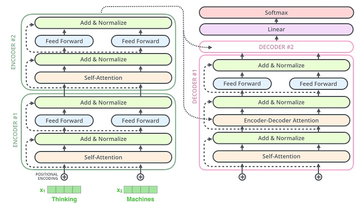

# Transformer

paper: [Attention is All you need](https://arxiv.org/abs/1706.03762) - 2017

## Encoding Text

Natural Language Processing (NLP)

Natural language text - Machine learning model - Prediction(Class, Real value, Text, ...)

Example: Sentiment Classification

### How should we encode text in ML models?
**Naive view: words are discrete and independent tokens.**

1. Build a dictionary of tokens
2. Assign an index to each token
3. Use the "one-hot" embedding of the tokens
- disadventage: dense vector high demension, token no relation, use axis

**More realistic view: words are continuous vectors in an N-dimensional space**

**Desirable Word Embedding Properties**
Embeddings can encode multiple aspects of a token

```
queen = [0.1, -0.3, 1.2, -0.4, 0.02, 1.1, -0.25, ...]
gender = queen[:3]
part-of-speech = queen[3:6]
etc = queen[6:]
```

The mechanism  to express relationships is relative vector distance.
```
dist(man, king) < dist(man, queen)
dist(woman, queen) < dist(woman, king)
dist(man, woman) == dist(king, queen)
```

| Token | Index | One-hot vector | Continuous vector |
| --- | --- | --- | --- |
| aardvark | 0 | [1, 0, 0] | [0.3, 1.9, -0.4] |
| king | 1 | [0, 1, 0] | [2.1, -0.7, 0.2] |
| queen | 2 | [0, 0, 1] | [0.5, 1.3, 0.9] |

### Where can we learn these relationships from?

Wikipedia(28 billon words, 309 languages)

Unsupervised text data → supervised task

## Language Modeling & Transformers

Traditionally, language modeling is defined as the task of estimating

```
P_theta(word_n | word_n-1, word_n-2, ..., word_0)
```

More generally:

```
P_theta(text | context)
```

Word2vec(2013) - RNNs popularized for LMs(2014) - Transformers(2017)

### Word2vec

**Prediction Process**

Embedding
```
○○: bank
○○: fish
○○: on
○○: river
○○: the
```
○○ - 2 dimensional vectors

Input: on the river ___

Embedding lookup: ○○ - ○○ - ○○

Averaged embeddings: ○○

output: [●○●○○] - Softmax Parameters(change 2 dimensional vectors to 5 dimensional vectors.)

Logistic Regression to predict the next word: prop the each word.

Loss function: Cross entropy

**Disadvantages**

Problem: word embeddings are context-independent.

open a <u>bank</u> account - bank: [0.3, 0.2, -0.8, ...]

on the river <u>bank</u> - bank: [0.3, 0.2, -0.8, ...]

Ideally, representations should be contextual

open a <u>bank</u> account - bank: [0.9, -0.2, 1.6, ...]

on the river <u>bank</u> - bank: [-1.9, -0.4, 0.1, ...]

### RNNs popularized for LMs

**Prediction Process**

on - the - river - bank - they - ____

```
Yi -       Y0     Y1     Y2     Y3     Y4
           ↑ H1   ↑ H2   ↑ H3   ↑ H4   ↑ H5
Hi - H0 → cell → cell → cell → cell → cell → softmax parameters
           ↑      ↑      ↑      ↑      ↑
xi -       x0     x1     x2     x3     x4
```
xi: Non-contextual embeddings

Hi: Hidden states

Yi: Contextual embeddings

**Disadvantage of RNN Encoders**

1. Slow: O(N) in the number of tokens N
2. Vanishing Gradient: cannot process very long sequences
3. Unidirectional: process text left to right, unlike humans
- Consider
  - on the **river** bank
  - on the bank of the **river**

### Transformers

**Prediction Process**

on - the - river - bank - they - ____: Key tokens

```
Yi -       Y0     Y1     Y2     Y3     Y4
           ↑      ↑      ↑      ↑      ↑ 
           SA     SA     SA     SA     SA
           ↑      ↑      ↑      ↑      ↑
xi -       x0     x1     x2     x3     x4
```

xi: Non-contextual embeddings(or Query token)

Yi: contextual embeddings

Attention is similar to a soft dictionary lookup.
```
dict = {
    on:     v0,
    the:    v1,
    river:  v2, 
    bank:   v3,
    they:   v4,
    [MASK]: v5, 
}

lookup(dict, bank) = v0 * 0.04 + v1 * 0.04 + v2 * 0.30 + v3 * 0.60 + v4 * 0.02 + v5 * 0.0
```

SA: Self-Attention

Model parameters: [K, Q, V] - Attention Head

keys * Query = Attention scores

Input * Value Params(V) = Values

Attention Scores * Values = Yi

**Multi Headed Self Attention**

```
Attention Scores * Values = Yi_1 ┐
Attention Scores * Values = Yi_2 ├─ FFNN - Yi
...                              │
Attention Scores * Values = Yi_N ┘
```
FFNN - Feed Forward Neural Networks

This is quite expensive: O(N^2) connections. But we can compute all Y's in parallel.

**Disadvantages of Transformer Encoders**

1. Computationally intense: O(N^2L)
2. Input must have a fixed number of tokens
- Because the number of position embeddings needs to be finite.
- All inputs are truncated or padded to e.g. 512 tokens.

## Transfer Learning & BERT

### Transfer Learning
- Many NLP tasks require common knowledge about language:
  - sentiment classification
  - named entity recognition
  - question answering
  - machine translation
  - ...
- Unlabeled data is abundant, labeled data is limited.
- Sequential paradigm: pre-training + fine-tuning
  - pre-training: usally LM(Language Model)
  - fine-tuning: any "target" task

### Transfer Learning with Transformers
Pre-training: Language modeling

```
            monarch
               ↑
      Transformer Encoder
               ↑
        Embedding Table
               ↑
King is the title given to a male ___
```

Fine-tuning: Sentiment Classification
- Copy Embedding Table & Transformer Encoder
- Fine-tune the entire stack

```
            positive
               ↑
           Classifier - Add Classifier
               ↑
      Transformer Encoder
               ↑
        Embedding Table
               ↑
Bittersweet and brilliant to the very end
```

### BERT

BERT: Bidirectional Encoder Representations from Transformers
- Bert is a Transformer Encoder trained on Wikipedia
- Readily available for download on:
  - English (24 different sizes)
  - Chinese
  - Multilingual(104 languages)

**The BERTology**
BERT's success inspired a lot of follow-up work:
- RoBERTa(more robust training)
- More efficent models(fewer parameters, faster inference):
  - ALBERT
  - MobileBERT
  - TinyBERT...
- Language-specific models:
  - French: FlauBERT, CamenBERT
  - Chinese: AMBERT
  - ...

## Code

### Transformer Architecture


### Input Embedding / Output Embedding
```python
class TokenEmbedding(layers.Embedding):
    def __init__(self, vocab_size, embedding_dim):
        super(TokenEmbedding, self).__init__(vocab_size, embedding_dim)
```


### Positonal Encoding


```python
class PositionalEncoding(layers.Layer):
    def __init__(self, d_model, max_position_embedding):
        super(PositionalEncoding, self).__init__()
        self.embedding = tf.zeros([max_position_embedding, d_model])
        position = np.arange(0, max_position_embedding)
        position = np.expand_dims(position, axis=1)

        i2 = np.arange(0, d_model, step=2).astype(np.float32)

        self.embedding[:, 0::2] = np.sin(position / (10000 ** (i2 / d_model)))
        self.embedding[:, 1::2] = np.cos(position / (10000 ** (i2 / d_model)))

    def forward(self, x):
        batch_size, length = x.shape
        return self.embedding[:length, :]
```

### Transformer Embedding
```python
class TransformerEmbedding(layers.Layer):
    def __init__(self, vocab_size, d_model, max_position_embedding, dropout_prob):
        super(TransformerEmbedding, self).__init__()
        self.token_embedding = TokenEmbedding(vocab_size, d_model)
        self.pos_encoding = PositionalEncoding(d_model, max_position_embedding)
        self.dropout = layers.Dropout(rate=dropout_prob)

    def forward(self, x):
        token_embedding = self.token_embedding(x)
        pos_encoding = self.pos_encoding(x)
        return self.dropout(token_embedding + pos_encoding)
```


### Multi Head Attention


```python
class MultiHeadAttention(layers.Layer):
    def __init__(self, d_model, num_attention_heads):
        super(MultiHeadAttention, self).__init__()
        self.num_attention_heads = num_attention_heads
        self.attention = ScaleDotProductAttention()
        self.w_q = layers.Dense(d_model)
        self.w_k = layers.Dense(d_model)
        self.w_v = layers.Dense(d_model)
        self.w_concat = layers.Dense(d_model)

    def forward(self, query, key, value, mask=None):
        query, key, value = self.w_q(query), self.w_k(key), self.w_v(value)
        query, key, value = self.split(query), self.query(key), self.query(value)

        out, attention = self.attention(query, key, value, mask=mask)

        out = self.concat(out)
        out = self.w_concat(out)
        return out

    def split(self, tensor):
        batch_size, length, d_model = tensor.shape

        d_model = d_model // self.num_attention_heads
        tensor = tf.reshape(
            tensor, [batch_size, length, self.num_attention_heads, d_model]
        )
        tensor = tf.transpose(tensor, perm=[0, 2, 1, 3])
        return tensor

    def concat(self, tensor):
        batch_size, head, length, d_tensor = tensor.shape
        d_model = head * d_tensor

        tensor = tf.transpose(tensor, perm=[0, 2, 1, 3])
        tensor = tf.reshape(tensor, [batch_size, length, d_model])
        return tensor

```

### Scale Dot Product Attention


```python
class ScaleDotProductAttention(layers.Layer):
    def __init__(self):
        super(ScaleDotProductAttention, self).__init__()
        self.softmax = layers.Softmax(axis=-1)

    def forward(self, query, key, value, mask=None, e=1e-12):
        batch_size, head, length, d_tensor = key.shape

        key = key.transpose()
        score = (query @ key) / tf.sqrt(d_tensor)

        if mask is not None:
            tf.where(mask, -e, score)

        score = self.softmax(score)

        value = score @ value

        return value, score
```

### Layer Normalization


```python
from tensorflow.keras.layers import LayerNormalization

norm = LayerNormalization(
    axis=-1, epsilon=1e-12, beta_initializer="zeros", gamma_initializer="ones"
)
```

### Positionwise Feed Forward


```python
class PositionwiseFeedForward(layers.Layer):
    def __init__(self, d_model, hidden, dropout_prob=0.1):
        super(PositionwiseFeedForward, self).__init__()
        self.dense1 = layers.Dense(hidden)
        self.dense2 = layers.Dense(d_model)
        self.relu = layers.ReLU()
        self.dropout = layers.Dropout(rate=dropout_prob)

    def forward(self, x):
        x = self.dense1(x)
        x = self.dense2(x)
        x = self.relu(x)
        x = self.dropout(x)
        return x
```

### Encoder / Decoder



### Encoder Identical Layer

```python
class EncoderIdenticalLayer(layers.Layer):
    def __init__(self, d_model, ffn_hidden, num_attention_heads, dropout_prob):
        super(EncoderIdenticalLayer, self).__init__()
        self.attention = MultiHeadAttention(
            d_model=d_model, num_attention_heads=num_attention_heads
        )
        self.norm1 = LayerNormalization(
            axis=-1, epsilon=1e-12, beta_initializer="zeros", gamma_initializer="ones"
        )
        self.dropout1 = layers.Dropout(rate=dropout_prob)

        self.ffn = PositionwiseFeedForward(
            d_model=d_model, hidden=ffn_hidden, drop_prob=dropout_prob
        )
        self.norm2 = LayerNormalization(
            axis=-1, epsilon=1e-12, beta_initializer="zeros", gamma_initializer="ones"
        )
        self.dropout2 = layers.Dropout(rate=dropout_prob)

    def forward(self, x, s_mask):
        _x = copy.deepcopy(x)
        x = self.attention(query=x, key=x, value=x, mask=s_mask)

        x = self.norm1(x + _x)
        x = self.dropout1(x)

        _x = copy.deepcopy(x)
        x = self.ffn(x)

        x = self.norm2(x + _x)
        x = self.dropout2(x)
        return x

```

### Decoder Identical Layer

```python
class DecoderIdenticalLayer(layers.Layer):
    def __init__(self, d_model, ffn_hidden, num_attention_heads, dropout_prob):
        super(DecoderIdenticalLayer, self).__init__()
        self.self_attention = MultiHeadAttention(d_model, num_attention_heads)
        self.norm1 = LayerNormalization(
            axis=-1, epsilon=1e-12, beta_initializer="zeros", gamma_initializer="ones"
        )
        self.dropout1 = layers.Dropout(rate=dropout_prob)

        self.enc_dec_attention = MultiHeadAttention(d_model, num_attention_heads)
        self.norm2 = LayerNormalization(
            axis=-1, epsilon=1e-12, beta_initializer="zeros", gamma_initializer="ones"
        )
        self.dropout2 = layers.Dropout(rate=dropout_prob)

        self.ffn = PositionwiseFeedForward(d_model, ffn_hidden, dropout_prob=dropout_prob)
        self.norm3 = LayerNormalization(
            axis=-1, epsilon=1e-12, beta_initializer="zeros", gamma_initializer="ones"
        )
        self.dropout3 = layers.Dropout(rate=dropout_prob)

    def forward(self, dec, enc, t_mask, s_mask):
        _x = copy.deepcopy(dec)
        x = self.self_attention(query=dec, key=dec, value=dec, mask=t_mask)

        x = self.norm1(x + _x)
        x = self.dropout1(x)

        if enc is not None:
            _x = copy.deepcopy(x)
            x = self.enc_dec_attention(query=x, key=enc, value=enc, mask=s_mask)

            x = self.norm2(x + _x)
            x = self.dropout2(x)

        _x = copy.deepcopy(x)
        x = self.ffn(x)

        x = self.norm3(x + _x)
        x = self.dropout3(x)
        return x
```

### Encoder

```python
class Encoder(layers.Layer):
    def __init__(
        self,
        enc_voc_size,
        max_position_embedding,
        d_model,
        ffn_hidden,
        num_attention_heads,
        num_hidden_layers,
        dropout_prob,
    ):
        super().__init__()
        self.emb = TransformerEmbedding(
            vocab_size=enc_voc_size,
            d_model=d_model,
            max_position_embedding=max_position_embedding,
            dropout_prob=dropout_prob,
        )

        self.layers = []
        for _ in range(num_hidden_layers):
            self.layers.appned(
                EncoderIdenticalLayer(
                    d_model, ffn_hidden, num_attention_heads, dropout_prob
                )
            )

    def forward(self, x, s_mask):
        x = self.emb(x)

        for layer in self.layers:
            x = layer(x, s_mask)

        return x

```

### Decoder

```python
class Decoder(layers.Layer):
    def __init__(
        self,
        dec_voc_size,
        max_position_embedding,
        d_model,
        ffn_hidden,
        num_attention_heads,
        num_hidden_layers,
        dropout_prob,
    ):
        super(Decoder, self).__init__()
        self.emb = TransformerEmbedding(
            vocab_size=dec_voc_size,
            d_model=d_model,
            max_position_embedding=max_position_embedding,
            drop_prob=dropout_prob,
        )

        self.layers = []
        for _ in range(num_hidden_layers):
            self.layers.append(
                DecoderIdenticalLayer(
                    d_model, ffn_hidden, num_attention_heads, dropout_prob
                )
            )

        self.dense = layers.Dense(dec_voc_size)

    def forward(self, x, enc_src, trg_mask, src_mask):
        x = self.emb(x)

        for layer in self.layers:
            x = layer(x, enc_src, trg_mask, src_mask)

        output = self.dense(x)
        return output

```

### Transformer

```python
class Transformer(layers.Layer):
    def __init__(
        self,
        src_pad_idx,
        trg_pad_idx,
        trg_sos_idx,
        enc_voc_size,
        dec_voc_size,
        d_model,
        num_attention_heads,
        max_position_embedding,
        ffn_hidden,
        num_hidden_layers,
        dropout_prob,
    ):
        super().__init__()
        self.src_pad_idx = src_pad_idx
        self.trg_pad_idx = trg_pad_idx
        self.trg_sos_idx = trg_sos_idx
        self.encoder = Encoder(
            enc_voc_size=enc_voc_size,
            max_position_embedding=max_position_embedding,
            d_model=d_model,
            ffn_hidden=ffn_hidden,
            num_attention_heads=num_hidden_layers,
            num_hidden_layers=num_hidden_layers,
            dropout_prob=dropout_prob,
        )

        self.decoder = Decoder(
            dec_voc_size=dec_voc_size,
            max_position_embedding=max_position_embedding,
            d_model=d_model,
            ffn_hidden=ffn_hidden,
            num_attention_heads=num_attention_heads,
            num_hidden_layers=num_hidden_layers,
            dropout_prob=dropout_prob,
        )

    def forward(self, src, trg):
        src_mask = self.make_pad_mask(src, src)

        src_trg_mask = self.make_pad_mask(trg, src)

        trg_mask = self.make_pad_mask(trg, trg) * self.make_no_peak_mask(trg, trg)

        enc_src = self.encoder(src, src_mask)
        output = self.decoder(trg, enc_src, trg_mask, src_trg_mask)
        return output

    def make_pad_mask(self, query, key):
        len_q, len_k = query.shape[1], key.shape[1]

        key = (key == self.src_pad_idx).expand_dims(1).expand_dims(2)
        key = tf.repeat(key, [1, 1, len_q, 1])

        query = (query == self.src_pad_idx).expand_dims(1).expand_dims(3)
        query = tf.repeat(query, [1, 1, 1, len_k])

        mask = key & query
        return mask

    def make_no_peak_mask(self, query, key):
        len_q, len_k = query.shape[1], key.shape[1]

        mask = np.tril(np.ones([len_q, len_k])).astype(np.bool8)

        return tf.convert_to_tensor(mask)
```

### Parameters

```
batch_size = 128
max_position_embedding = 256
d_model = 512
num_hidden_layers = 6
num_attention_heads = 8
ffn_hidden = 2048
dropout_prob = 0.1
init_lr = 0.1
factor = 0.9
patience = 10
warmup = 100
adam_eps = 5e-9
epoch = 1000
clip = 1
weight_decay = 5e-4
```